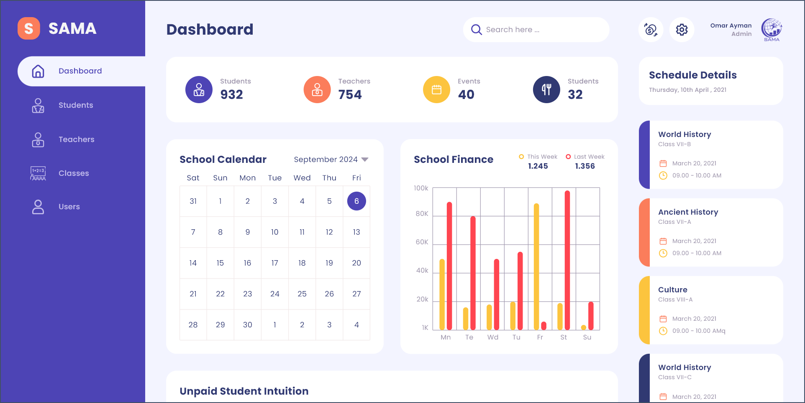
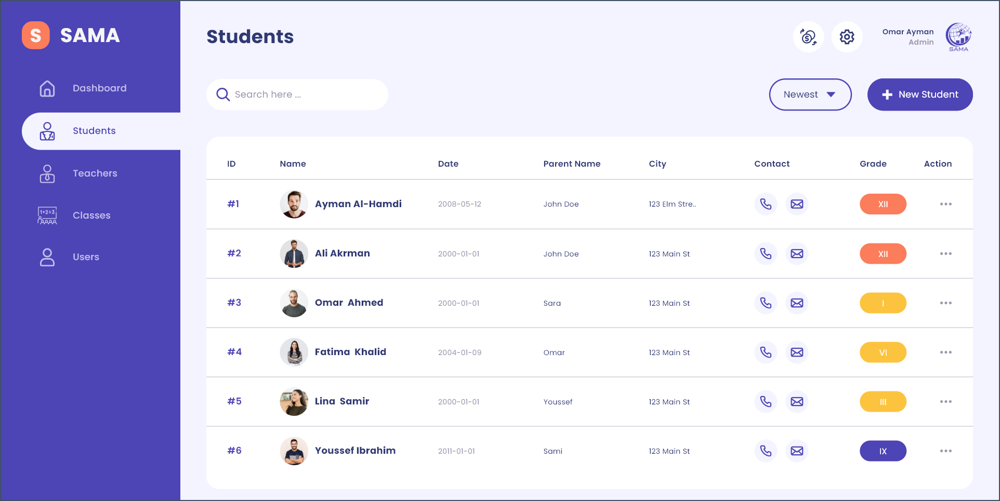
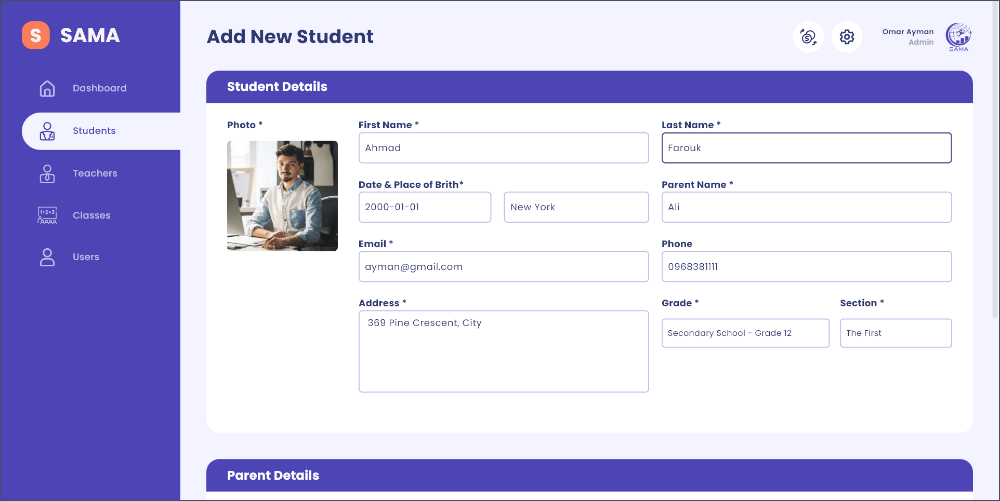
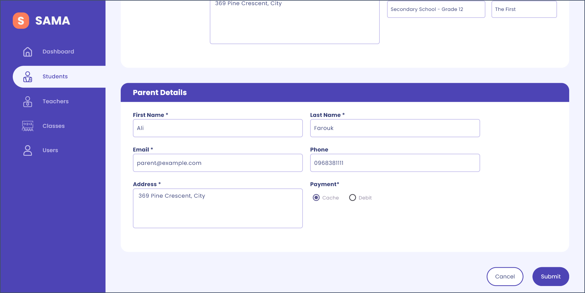
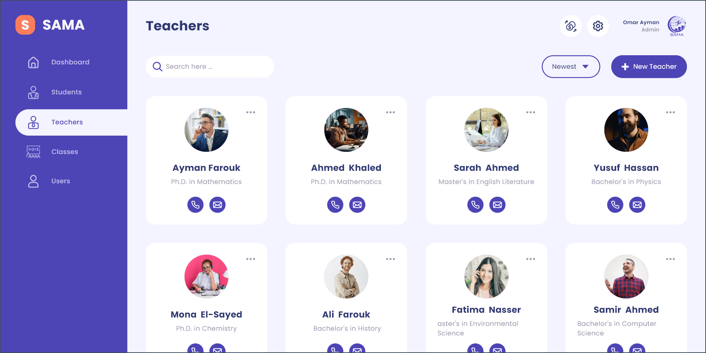
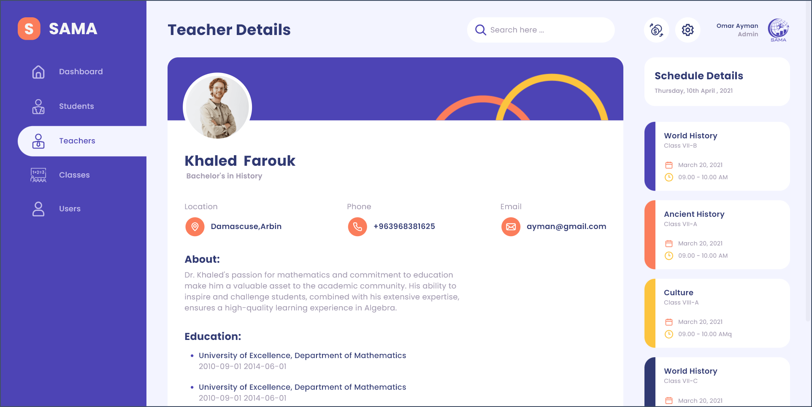
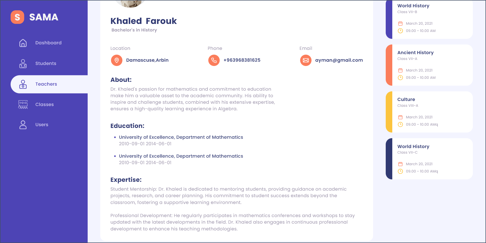
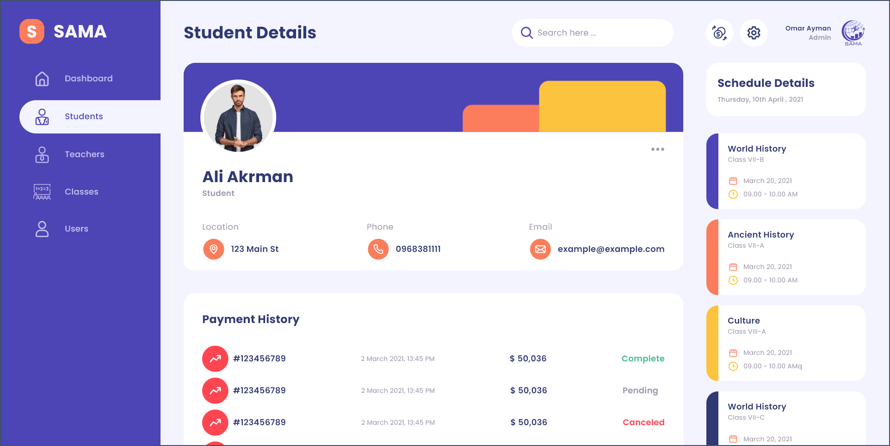
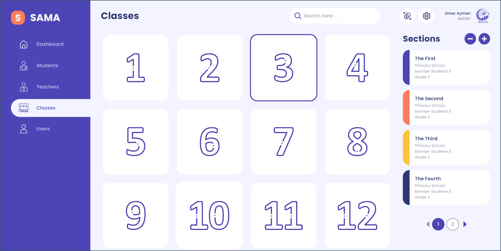
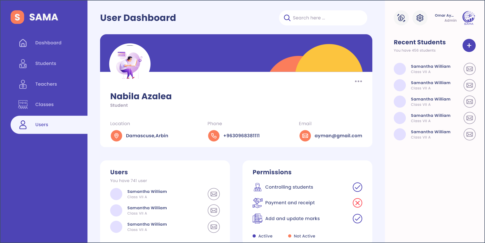

# **School Management App** 📚

**School Management App** is a comprehensive platform designed to streamline the administration and operation of schools. The application centralizes key functions such as managing student profiles 👩‍🎓👨‍🎓, and maintaining a calendar view with highlighted current days 📅. It offers robust search functionality 🔍, the ability to add and visit student profiles 🏫, and track their payment statuses 💸. Additionally, the app includes a notes section for important reminders 📝 and a settings area for customization ⚙️. **School Management App** is crafted to enhance school management efficiency, providing a user-friendly and effective solution for school administrators.

## Main Sections 🚀

- **Main Interface** 📊  
  *Displays comprehensive charts comparing incoming and outgoing funds, offering a clear financial overview. The financial data helps in budgeting, forecasting, and tracking school expenses and revenue.*

- **Calendar View** 📅  
  *Features an interactive calendar that highlights the current day and allows users to manage daily tasks and responsibilities. Notes can be added to specific dates to track important events, deadlines, and school duties.*

- **Class and Branch Management** 🏫  
  *Provides functionality for creating and organizing classes and student branches. Administrators can add classes (e.g., first grade, second grade) and assign students to specific branches (e.g., third youth, tenth grade), facilitating effective student management and class scheduling.*

- **Student and Teacher Management** 👩‍🎓👨‍🏫  
  *Enables detailed management of student and teacher profiles. Administrators can view and update personal information, contact details, and other relevant data, ensuring accurate and up-to-date records.*

- **Payment Management** 💸  
  *Allows for comprehensive management of student payments. Features include modifying payment statuses, adding new payments, viewing payment history, and tracking outstanding balances, helping to ensure financial accuracy and transparency.*

- **Local Data Storage** 🗄️  
  *Utilizes Hive for secure and efficient local data storage. This feature ensures quick access to information, data integrity, and reliable performance, even in offline scenarios.*

- **User Interface Design** 🎨  
  *Offers a visually appealing and intuitive design, enhancing user experience. The interface is crafted to be user-friendly, making navigation smooth and operations straightforward.*

## **Note:** 🛠️  
*The School Management App is currently under development. A preliminary version has not been released yet. The app will be completed and available for use when development is finalized.*

## Application Screenshots 📸

    
    
    
    
    
    
    
    
    
    

